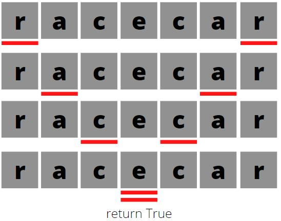

# two-pointers

the two pointer technique is a very simple yet powerful tool that can save both time and space complexity. there are cases where you can use two pointers solution instead of a nested loop, for instance, reducing the time complexity from O(n^2) to O(n).
this technique simply implies that you are looping an array using two points of consideration instead of the usual one.

lets use the `isPalyndrome` function as example. to check if a word is a palyndrom we have to make sure it reads the same backwards as forward, a perfect situation to use the two pointer tecnique. the graphic representation of this function using the two pointers can be found below. the pointers are represented by the red line under the letters.





the code for the function above can be found below


```python
def isPalyndrome(word):
	left_pointer = 0
	right_pointer = len(word)-1
	while left_pointer < right_pointer:
		if word[left_pointer] != word[right_pointer]:
			return False
		left_pointer += 1
		right_pointer -= 1
	return True
```

making use of the knowledge you could get on [two sum](questions/arrays/two-sum.md) and the information on this page, try solving [two sum ii](questions/arrays/two-sum-ii.md)

also read [sliding window](sliding-window.md). 

### when to use it

whenever there is an array and the question deals with finding two elements that satisfy a certain condition inside that array, two-pointer should be the first technique that comes to mind.

typical questions that rely on two-pointers contain requirements like this:
* search for two or more items
* search multiple items in a sorted array
* compare the end of the array with the begining


### questions to exercise it
[two sum ii](questions/arrays/two-sum-ii.md)

[longest substring without repeating characters](questions/hash-tables/longest-substring-without-repeating-characters.md)
